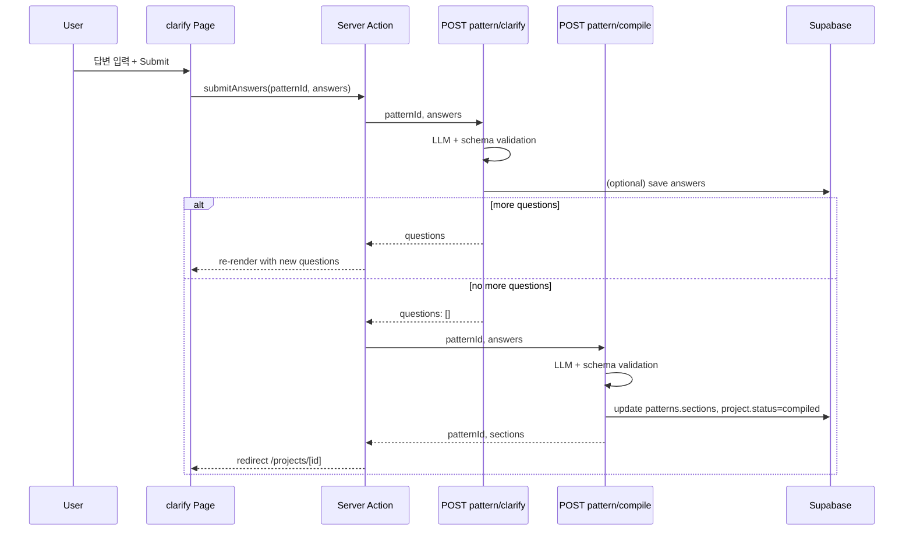

# KnitLens 두 번째 스펙: Clarification & Pattern Compilation (PRD)

**문서 유형**: 제품 요구사항·구현 계획 (PRD + 구현 플랜)  
**대상 스펙**: `/projects/[id]/clarify` (명확화 질문 UI + 답변 제출) 및 `POST /api/pattern/clarify`, `POST /api/pattern/compile`  
**목적**: 개발·기획·QA가 범위·수용 기준·작업 순서를 공유하는 단일 소스.

---

## 1. 배경 및 선정 이유

- **화면 플로우** ([docs/architecture/screen-flow.md](docs/architecture/screen-flow.md)): Create Project → Pattern Analysis → **Clarification (optional)** → Pattern Compilation → Project Tracker.
- **빌드 플랜 Phase 2** ([docs/product/build-plan-48h.md](docs/product/build-plan-48h.md)): Project creation, Pattern analysis API, **Clarification UI**.
- **첫 스펙 완료 상태**: `/projects/new` 및 `POST /api/pattern/analyze` 구현 완료. 질문이 있으면 `/projects/[id]/clarify`로 리다이렉트되나, 해당 페이지는 플레이스홀더이며 clarify/compile API 미구현.

**선정 이유**

- 플로우상 분석 직후 단계로, 트래커(`/projects/[id]`)는 컴파일 완료 후에만 의미 있음.
- 명확화 → 컴파일 → 트래커 순서가 고정되어 있어, Clarification 스펙을 먼저 완료해야 트래커 스펙 범위가 명확해짐.

---

## 2. 범위

### 2.1 포함

- **화면**: `/projects/[id]/clarify`
  - 페이지 제목, 명확화 요약, 질문 목록, 답변 입력(choice/number/text), 제출/계속 버튼.
- **API**
  - `POST /api/pattern/clarify`: 답변 제출 → 추가 질문 필요 시 `questions` 반환, 완료 시 `questions: []`.
  - `POST /api/pattern/compile`: `patternId` + `answers`로 최종 패턴 컴파일 → sections 저장, 프로젝트 상태 `compiled`로 전이.
- **데이터**
  - Clarification 답변 저장 (신규 테이블 또는 엔티티).
  - 컴파일 시 기존 `patterns.sections` 업데이트, `Project.status` → `compiled`.
- **플로우**
  - 추가 질문 있음 → 같은 페이지에 갱신된 질문 표시.
  - 질문 없음(클라이언트는 `questions.length === 0` 수신) → `POST /api/pattern/compile` 호출 후 성공 시 `/projects/[id]`로 리다이렉트.

### 2.2 제외 (후속 스펙)

- `/projects/[id]`: 트래커 본문 UI, `GET /api/projects/[id]`, `POST /api/projects/[id]/progress`.
- 프로젝트 목록/홈에서 clarify로 가는 직접 진입점(이미 분석 후 리다이렉트로 진입).

---

## 3. 사용자 스토리와 시나리오

### 3.1 메인 사용자 스토리

- **As a** 니터
- **I want to** 분석 후 나온 명확화 질문에 답하고 "제출/계속"을 눌러
- **So that** 추가 질문이 있으면 계속 답하고, 없으면 컴파일된 패턴으로 트래커로 넘어갈 수 있다.

### 3.2 성공 시나리오

1. 사용자가 `/projects/[id]/clarify`에 접속한다(분석 후 리다이렉트 또는 직접 URL).
2. 프로젝트·패턴에 속한 clarification questions를 서버에서 조회해 표시한다.
3. 사용자가 각 질문에 답(선택/숫자/텍스트)을 입력하고 "Submit" / "Continue"를 클릭한다.
4. 클라이언트가 `POST /api/pattern/clarify`에 `patternId`, `answers`를 보낸다.
5. 응답이 `questions.length > 0`이면 같은 페이지에 새 질문을 표시하고, 필요 시 이전 답변은 유지·전달한다.
6. 응답이 `questions.length === 0`이면 클라이언트가 `POST /api/pattern/compile`을 호출한다.
7. 컴파일 성공 시 `/projects/[id]`로 리다이렉트한다.

### 3.3 예외 시나리오

- **프로젝트/패턴 없음**: 404 또는 "Project not found" 안내.
- **프로젝트 상태가 clarification이 아님**: 적절한 안내 또는 리다이렉트.
- **필수 답변 누락**: "모든 질문에 답해 주세요" 등 메시지.
- **clarify/compile API 검증 실패**: api-contract의 에러 코드·메시지를 사용자 친화 문구로 표시.

---

## 4. 기능 요구사항

### 4.1 페이지 `/projects/[id]/clarify`

| ID  | 요구사항                                                      | 비고                                                                                                |
| --- | --------------------------------------------------------- | ------------------------------------------------------------------------------------------------- |
| F1  | 페이지 제목을 노출한다.                                             | 예: "Pattern Clarification"                                                                        |
| F2  | 명확화 요약(선택) 또는 현재 질문 세트 설명을 표시한다.                          | [docs/design/stitch/clarification_v2/code.html](docs/design/stitch/clarification_v2/code.html) 참고 |
| F3  | 서버에서 조회한 clarification questions 목록을 표시한다.                | choice: 옵션 라디오/버튼, number/text: 입력 필드                                                             |
| F4  | "Submit" / "Continue" 버튼을 제공한다.                           | 주 액션                                                                                              |
| F5  | 제출 중 로딩 상태를 표시한다.                                         | 스피너 또는 버튼 비활성화                                                                                    |
| F6  | 실패 시 에러 메시지를 표시한다.                                        | clarify/compile 에러 매핑                                                                             |
| F7  | clarify 응답이 `questions: []`일 때 자동으로 compile 호출 후 리다이렉트한다. | 클라이언트 또는 서버 액션                                                                                    |

### 4.2 API `POST /api/pattern/clarify`

| ID  | 요구사항                                               | 비고                                                                     |
| --- | -------------------------------------------------- | ---------------------------------------------------------------------- |
| F8  | 요청 본문 검증: `patternId`, `answers` (Answer[]).       | [docs/architecture/api-contract.md](docs/architecture/api-contract.md) |
| F9  | LLM 호출: 기존 패턴 텍스트 + 기존 답변 + 새 답변으로 추가 질문 필요 여부 판단. | BYOK, JSON-only, 스키마 검증                                                |
| F10 | 성공 시 `{ questions: Question[] }` 반환.               | 추가 질문 없으면 `questions: []`                                              |
| F11 | 필요 시 답변 저장(ClarificationAnswer).                   | 상태 일관성                                                                 |

### 4.3 API `POST /api/pattern/compile`

| ID  | 요구사항                                                      | 비고                                                                       |
| --- | --------------------------------------------------------- | ------------------------------------------------------------------------ |
| F12 | 요청 본문 검증: `patternId`, `answers`.                         | api-contract 준수                                                          |
| F13 | LLM 호출: 원본 패턴 텍스트 + 전체 답변으로 최종 sections(rows, steps) 생성.  | ai-spec Pattern Compilation                                              |
| F14 | LLM 응답을 런타임 스키마로 검증.                                      | Section/Row/Step 구조                                                      |
| F15 | 성공 시 patterns.sections 업데이트, Project.status → `compiled`. | [docs/architecture/state-machine.md](docs/architecture/state-machine.md) |
| F16 | 응답: `patternId`, `sections`.                              | api-contract                                                             |

### 4.4 데이터 및 상태

| ID  | 요구사항                                     | 비고                                                                        |
| --- | ---------------------------------------- | ------------------------------------------------------------------------- |
| F17 | Clarification 답변을 저장할 수 있는 구조.           | data-model의 ClarificationAnswer; 미그레이션에 `clarification_answers` 테이블 추가 검토 |
| F18 | 컴파일 시 기존 `patterns` 행의 `sections`만 업데이트. | 새 패턴 생성이 아닌 갱신                                                            |

---

## 5. 비기능 요구사항 및 제약

- **UI**: [.cursor/rules/frontend-system-css.md](.cursor/rules/frontend-system-css.md) 및 레트로 맥 스타일. Stitch 목업 [docs/design/stitch/clarification_v2/](docs/design/stitch/clarification_v2/) 참고.
- **아키텍처**: Next.js App Router, Server Component 우선. 폼·제출·로딩만 최소 Client Component.
- **데이터**: Supabase 접근은 서버 전용 모듈에서만.
- **AI**: JSON 전용, 명시적 스키마, 런타임 검증, BYOK. [.cursor/rules/ai-integration.md](.cursor/rules/ai-integration.md), [docs/product/ai-spec.md](docs/product/ai-spec.md).

---

## 6. 수용 기준

- `/projects/[id]/clarify`에서 프로젝트의 clarification questions가 로드되어 표시된다.
- 사용자가 모든 질문에 답하고 Submit/Continue를 누르면 `POST /api/pattern/clarify`가 호출된다.
- clarify가 추가 질문을 반환하면 같은 페이지에 새 질문이 표시되고, 다시 답해 제출할 수 있다.
- clarify가 `questions: []`를 반환하면 클라이언트가 `POST /api/pattern/compile`을 호출하고, 성공 시 `/projects/[id]`로 리다이렉트된다.
- compile 성공 시 해당 프로젝트의 `patterns.sections`가 갱신되고 `Project.status`가 `compiled`이다.
- 답변 누락, 잘못된 payload, clarify/compile 검증 실패 시 사용자에게 알 수 있는 메시지가 표시된다.
- UI는 system.css 및 레트로 스타일 가이드에 맞다.

---

## 7. 기술 설계 및 데이터 흐름

- **질문 로드**: clarify 페이지 로드 시 서버에서 `projectId`로 프로젝트·패턴·clarification_questions 조회 (이미 analyze에서 저장됨).
- **답변 누적**: 여러 라운드에서 이전 답변을 clarify API에 함께 보내는 방식은 api-contract·LLM 설계에 맞춰 구현(서버에서 기존 답변 조회 후 LLM에 전달할지, 클라이언트가 누적 전달할지 결정).

---

## 8. 구현 계획 (TODO)

### 8.1 데이터

- **clarification_answers** 테이블 추가 검토: data-model의 ClarificationAnswer (id, project_id, pattern_id, question_id, value). 필요 시 마이그레이션 추가.
- **서버 CRUD**: 답변 저장/조회 헬퍼 (필요 시). compile 시 `updatePattern(patternId, { sections })` 등 기존 [lib/supabase/patterns.ts](lib/supabase/patterns.ts) 확장.

### 8.2 API

- **POST /api/pattern/clarify**: 요청 검증, 프로젝트/패턴 조회, 원본 패턴 텍스트 + 답변으로 LLM 호출, 응답 스키마 검증, `{ questions }` 반환. 스킬 [.cursor/skills/implement-llm-json-route/SKILL.md](.cursor/skills/implement-llm-json-route/SKILL.md) 참고.
- **POST /api/pattern/compile**: 요청 검증, 패턴 텍스트 + 전체 답변으로 LLM 호출, Section/Row/Step 스키마 검증, `patterns.sections` 업데이트 및 `Project.status` → `compiled`, `{ patternId, sections }` 반환.

### 8.3 화면

- **app/projects/[id]/clarify/page.tsx**: Server Component에서 프로젝트·패턴·질문 로드. 폼·제출·로딩·에러는 Client Component로 분리.
- 레이아웃: 페이지 제목, 명확화 요약, 질문 목록(타입별 입력), Submit/Continue 버튼. [docs/architecture/screens/projects-id-clarify.md](docs/architecture/screens/projects-id-clarify.md), [docs/design/stitch/clarification_v2/code.html](docs/design/stitch/clarification_v2/code.html) 참고.
- 서버 액션: clarify 호출 → `questions.length === 0`이면 compile 호출 → 성공 시 `redirect(/projects/[id])`. 에러 시 메시지 반환.

### 8.4 문서 및 품질

- 이 PRD를 `docs/product/specs/` 또는 `.cursor/plans/`에 보관.
- (선택) [.cursor/skills/retro-ui-review/SKILL.md](.cursor/skills/retro-ui-review/SKILL.md)로 clarify 페이지 시각 QA.

---

## 9. 참조 문서

| 문서                                                                                                   | 용도                                                     |
| ---------------------------------------------------------------------------------------------------- | ------------------------------------------------------ |
| [docs/architecture/screens/projects-id-clarify.md](docs/architecture/screens/projects-id-clarify.md) | 화면 목적, 섹션, 액션, API, 에러                                 |
| [docs/architecture/api-contract.md](docs/architecture/api-contract.md)                               | POST clarify/compile 요청/응답                             |
| [docs/architecture/data-model.md](docs/architecture/data-model.md)                                   | ClarificationQuestion, ClarificationAnswer, Project 상태 |
| [docs/architecture/state-machine.md](docs/architecture/state-machine.md)                             | clarification → compiled 전이                            |
| [docs/product/ai-spec.md](docs/product/ai-spec.md)                                                   | Clarification Question/Answer, Pattern Compilation 출력  |
| [docs/design/stitch/clarification_v2/code.html](docs/design/stitch/clarification_v2/code.html)       | Clarify UI 목업                                          |
| .cursor/rules/frontend-system-css.md                                                                 | UI 스타일                                                 |
| .cursor/skills/implement-screen-from-spec/SKILL.md                                                   | 화면 구현 워크플로우                                            |
| .cursor/skills/implement-llm-json-route/SKILL.md                                                     | LLM JSON 라우트 구현                                        |

---

## 10. 릴리즈 노트 초안

**버전**: v0.2.0  
**제목**: Clarification & Pattern Compilation

**Added**

- **/projects/[id]/clarify** — 명확화 질문 페이지.
  - 질문 목록 표시(choice/number/text), 답변 입력, Submit/Continue.
  - clarify 응답에 따라 추가 질문 표시 또는 compile 호출 후 `/projects/[id]` 리다이렉트.
- **POST /api/pattern/clarify** — 답변 제출 및 추가 질문 여부 반환.
- **POST /api/pattern/compile** — 최종 패턴 컴파일, sections 저장, 프로젝트 상태 `compiled` 전이.
- Clarification 답변 저장(테이블/헬퍼는 구현 선택에 따름).

**Changed**

- `/projects/[id]/clarify` 플레이스홀더 제거, 본문 UI 구현.

**Known limitations / Follow-ups**

- `/projects/[id]` 트래커 UI, GET /api/projects/[id], POST /api/projects/[id]/progress는 후속 스펙.

