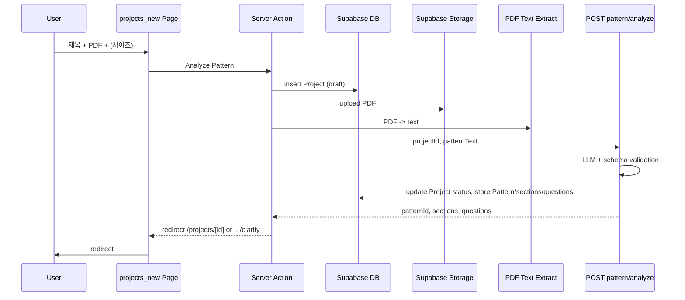

# KnitLens 첫 스펙: Create Project & Pattern Analysis

**문서 유형**: 제품 요구사항·구현 계획 (PRD + 구현 플랜)  
**대상 스펙**: `/projects/new` (새 프로젝트 생성 + PDF 업로드 + AI 패턴 분석)  
**목적**: 이 문서는 개발·기획·QA가 한 번에 읽고 범위·수용 기준·작업 순서를 공유하기 위한 단일 소스이다.

---

## 목차

1. [배경 및 선정 이유](#1-배경-및-선정-이유)
2. [범위](#2-범위)
3. [사용자 스토리와 시나리오](#3-사용자-스토리와-시나리오)
4. [기능 요구사항](#4-기능-요구사항)
5. [비기능 요구사항 및 제약](#5-비기능-요구사항-및-제약)
6. [수용 기준](#6-수용-기준)
7. [기술 설계 및 데이터 흐름](#7-기술-설계-및-데이터-흐름)
8. [구현 계획 (TODO)](#8-구현-계획-todo)
9. [참조 문서](#9-참조-문서)
10. [릴리즈 노트 초안](#10-릴리즈-노트-초안)

---

## 1. 배경 및 선정 이유

KnitLens는 PDF 니팅 패턴을 업로드하면 AI가 패턴을 해석하고, 필요 시 질문을 하고, 구조화된 단계로 컴파일한 뒤 사용자가 행 단위로 진행 상황을 추적할 수 있게 하는 제품이다. 전체 화면 플로우는 다음과 같다.

- **Create Project (PDF 업로드)** → Text Extraction → Pattern Analysis → Clarification (선택) → Pattern Compilation → Project Tracker

이 중 **첫 스펙**으로 **Create Project + Pattern Analysis** 구간을 선정했다.

**선정 이유**

- **진입점**: 위 플로우의 첫 단계이므로, 이후 모든 화면(명확화, 컴파일, 트래커)의 선행 조건이 된다.
- **명확한 유저 스토리**: “프로젝트를 만들고 PDF를 넣으면, AI가 패턴을 분석해서 다음 단계(트래커 또는 질문 화면)로 보내준다”까지 한 번에 정의할 수 있다.
- **프로젝트 내 일관성**: `docs/architecture/screen-flow.md`, `.cursor/WORKFLOW_LOG.md`의 Open questions, `docs/product/build-plan-48h.md` Phase 2에서 모두 “Project creation screen”을 우선으로 두고 있다.

이 문서는 위 구간을 **제품 요구사항 문서(PRD)** 수준으로 정리하고, 구현 시 따를 **TODO**와 **릴리즈 노트 초안**을 포함한다.

---

## 2. 범위

### 2.1 이번 스펙에 포함되는 것

- **화면**: `/projects/new` — 새 프로젝트 생성 전용 페이지
  - 프로젝트 제목 입력, 패턴 PDF 업로드(파일 선택 또는 드롭존), 선택적 사이즈 입력, “Analyze Pattern” 버튼
- **백엔드·인프라**
  - 프로젝트 생성 및 PDF 파일 저장 (Supabase: DB + Storage)
  - PDF에서 서버가 텍스트 추출
  - `POST /api/pattern/analyze`: 패턴 텍스트를 LLM으로 분석하고, 스키마 검증 후 결과 저장
- **플로우**
  - 분석 결과의 `questions` 배열 길이에 따른 리다이렉트
    - 비어 있음 → `/projects/[id]`
    - 하나라도 있음 → `/projects/[id]/clarify`
- **에러 처리**
  - PDF 미첨부·잘못된 파일, 텍스트 추출 실패, 분석·검증 실패 시 사용자에게 알림

### 2.2 이번 스펙에서 제외하는 것 (후속 스펙)

- `/projects/[id]`: 트래커 UI 및 진행 상태 표시·저장
- `/projects/[id]/clarify`: 명확화 질문 UI 및 답변 제출
- `POST /api/pattern/clarify`, `POST /api/pattern/compile`
- `GET /api/projects/[id]`, `POST /api/projects/[id]/progress`
- 프로젝트 목록/홈에서 “새 프로젝트”로 가는 진입점 (필요 시 별도 작업)

이번 스펙에서는 `/projects/[id]`와 `/projects/[id]/clarify`는 **플레이스홀더 페이지**만 두어, 리다이렉트가 정상 동작하는지 확인할 수 있으면 충분하다.

---

## 3. 사용자 스토리와 시나리오

### 3.1 메인 사용자 스토리

- **As a** 니터
- **I want to** 새 프로젝트를 만들고 PDF 패턴을 업로드한 뒤 “Analyze Pattern”을 눌러 AI가 패턴을 분석하게 하고
- **So that** 다음 단계(트래커 또는 명확화 질문)로 자동으로 넘어갈 수 있다.

### 3.2 성공 시나리오

1. 사용자가 `/projects/new`에 접속한다.
2. 프로젝트 제목을 입력하고, 패턴 PDF를 선택(또는 드롭)하고, 필요 시 사이즈를 선택한다.
3. “Analyze Pattern”을 클릭한다.
4. 시스템이 프로젝트를 생성하고, PDF를 저장한 뒤 텍스트를 추출하고, AI 분석을 호출한다.
5. 분석이 끝나면:

- **질문이 없으면**: `/projects/[id]`로 이동한다.
- **질문이 있으면**: `/projects/[id]/clarify`로 이동한다.

### 3.3 예외 시나리오

- **PDF를 넣지 않음**: “패턴 PDF를 선택해 주세요” 등 안내 메시지를 보여 준다.
- **지원하지 않는 파일 형식**: “PDF 파일만 업로드할 수 있습니다” 등 메시지를 보여 준다.
- **텍스트 추출 실패**: 서버/클라이언트에서 “패턴 텍스트를 읽을 수 없습니다” 등 메시지를 보여 준다.
- **분석/검증 실패**: API 계약에 맞는 에러 코드·메시지를 사용자 친화 문구로 변환해 보여 준다.

---

## 4. 기능 요구사항

### 4.1 페이지 `/projects/new`

| ID  | 요구사항                                 | 비고             |
| --- | ------------------------------------ | -------------- |
| F1  | 페이지 제목을 노출한다.                        | 예: “새 프로젝트”    |
| F2  | 프로젝트 제목을 입력할 수 있는 필드를 제공한다.          | 필수             |
| F3  | 패턴 PDF를 선택하거나 드롭할 수 있는 업로드 영역을 제공한다. | 파일 선택 또는 드롭존   |
| F4  | (선택) 사이즈를 선택할 수 있는 입력을 제공한다.         | 스펙상 optional   |
| F5  | “Analyze Pattern” 버튼을 제공한다.          | 주 액션           |
| F6  | 제출 중 로딩 상태를 표시한다.                    | 스피너 또는 비활성화 등  |
| F7  | 실패 시 에러 메시지를 표시한다.                   | F3·예외 시나리오와 연계 |

### 4.2 “Analyze Pattern” 동작

| ID  | 요구사항                                                  | 비고                                                    |
| --- | ----------------------------------------------------- | ----------------------------------------------------- |
| F8  | 프로젝트 레코드를 생성한다.                                       | 상태는 초기에 `draft` 등                                     |
| F9  | 업로드된 PDF를 저장하고 URL(또는 식별자)을 프로젝트/PatternSource에 기록한다. | Supabase Storage                                      |
| F10 | 저장된 PDF에서 서버가 텍스트를 추출한다.                              | 서버 전용 라이브러리                                           |
| F11 | `POST /api/pattern/analyze`를 호출한다.                    | 인자: `projectId`, `patternText`                        |
| F12 | 응답의 `questions` 길이에 따라 리다이렉트한다.                       | 0 → `/projects/[id]`, else → `/projects/[id]/clarify` |

### 4.3 API `POST /api/pattern/analyze`

| ID  | 요구사항                                                  | 비고                                    |
| --- | ----------------------------------------------------- | ------------------------------------- |
| F13 | 요청 본문을 검증한다.                                          | `projectId`, `patternText` (문서화된 스키마) |
| F14 | LLM을 호출하여 패턴 텍스트를 분석한다.                               | BYOK, JSON-only, 고정 스키마               |
| F15 | LLM 응답을 런타임 스키마로 검증한다.                                | 실패 시 구조화된 에러 반환                       |
| F16 | 성공 시 `patternId`, `sections`, `questions`를 반환한다.      | api-contract 및 ai-spec 준수             |
| F17 | 성공 시 프로젝트 상태를 갱신하고, Pattern·sections·questions를 저장한다. | 상태: `clarification` 또는 `compiled`     |

---

## 5. 비기능 요구사항 및 제약

- **UI**: `frontend-system-css.md` 및 레트로 맥 스타일을 따른다.
- **아키텍처**: Next.js App Router, Server Component 우선. 파일 업로드·폼 등 상호작용이 필요한 부분만 최소한의 Client Component로 분리한다.
- **데이터**: Supabase 접근은 서버 전용 모듈에서만 수행한다.
- **AI**: LLM 응답은 JSON 전용, 명시적 스키마, 런타임 검증, BYOK 제공자 추상화를 따른다. (규칙: `ai-integration.md`)

---

## 6. 수용 기준

다음이 모두 만족되면 이 스펙의 수용 기준을 충족한 것으로 본다.

- 사용자가 `/projects/new`에서 제목과 PDF를 입력하고 “Analyze Pattern”을 누르면, 프로젝트가 생성되고 PDF가 저장된다.
- 저장된 PDF에서 텍스트가 추출되고, 해당 텍스트로 `POST /api/pattern/analyze`가 호출된다.
- 분석 API가 문서화된 요청/응답 스키마를 따르며, 실패 시 문서화된 에러 형태를 반환한다.
- 분석 성공 시 `questions`가 비어 있으면 `/projects/[id]`로, 비어 있지 않으면 `/projects/[id]/clarify`로 리다이렉트된다.
- PDF 미첨부, 잘못된 파일, 추출 실패, 분석/검증 실패 시 사용자에게 알 수 있는 메시지가 표시된다.
- `/projects/[id]`와 `/projects/[id]/clarify`는 최소한 플레이스홀더라도 있어서, 리다이렉트 시 404가 나지 않는다.
- UI가 system.css 및 레트로 스타일 가이드에 맞게 구현되어 있다.

---

## 7. 기술 설계 및 데이터 흐름

### 7.1 전체 시퀀스

“Analyze Pattern” 클릭부터 리다이렉트까지의 흐름은 아래와 같다.

### 7.2 설계 노트

- **프로젝트 생성**: 현재 API 계약에는 `POST /api/projects`가 없으므로, 서버 액션(또는 내부 API)에서 Supabase에 프로젝트 행을 삽입하고 `projectId`를 얻는 방식으로 구현한다. 필요 시 나중에 공개 API로 분리할 수 있다.
- **PDF 저장**: Supabase Storage 버킷(예: `pattern-pdfs`)에 업로드한 뒤, data-model에 맞춰 `Project.patternPdfUrl` 또는 `PatternSource`에 URL을 저장한다.
- **상태 전이**: Project 상태는 data-model·state-machine 문서에 따라 `draft` → `analyzing` → `clarification` 또는 `compiled`로 갱신한다.

---

## 8. 구현 계획 (TODO)

아래 순서로 진행하면 의존성이 맞다. 각 항목은 완료 시 체크한다.

### 8.1 인프라 및 데이터

- **Supabase 설정**
  - 프로젝트 연결 및 env 설정 (`NEXT_PUBLIC_SUPABASE_URL`, `SUPABASE_SERVICE_ROLE_KEY` 또는 anon + RLS).
  - `projects` 테이블 생성 (data-model: id, title, patternPdfUrl, rawPatternText, status, createdAt, updatedAt).
  - `pattern_sources` 테이블 생성 또는 Project에 PDF URL만 저장하는 단순 모델 선택.
  - Storage 버킷 생성(예: `pattern-pdfs`) 및 업로드 정책 설정.
- **서버 전용 CRUD**
  - 프로젝트 생성: `createProject(title, ...)` → Project 반환.
  - PDF URL/메타 저장: Project 또는 PatternSource 업데이트.
  - (선택) Supabase 스킬 `supabase-crud-scaffold` 참고.

### 8.2 PDF 업로드 및 텍스트 추출

- **업로드**
  - 서버 액션 또는 API에서 `FormData`로 PDF 수신 → Storage 업로드 → URL 반환.
- **텍스트 추출**
  - 서버 전용 라이브러리 선택(예: `pdf-parse`, `pdfjs-dist`) 후 PDF → 텍스트 변환.
  - 추출 실패 시 구조화된 에러 반환(예: `{ error: "text_extraction_failed", message: "..." }`).

### 8.3 패턴 분석 API

- **POST /api/pattern/analyze 구현**
  - 요청 스키마: `{ projectId: string, patternText: string }` (api-contract 준수).
  - 응답 스키마: `{ patternId, sections: Section[], questions: Question[] }`.
  - LLM 호출: BYOK, JSON-only, 고정 스키마 (ai-spec, ai-integration 규칙).
  - 런타임 검증 후 실패 시 `{ error: "analysis_failed", message }` 반환.
  - 성공 시 Project 상태 갱신 및 Pattern·sections·questions 저장.
- 스킬 `implement-llm-json-route` 참고.

### 8.4 화면 `/projects/new`

- **라우트**
  - `app/projects/new/page.tsx` 생성 (기본 Server Component).
- **레이아웃·UI**
  - 페이지 제목, 프로젝트 제목 입력, PDF 업로드(파일 선택 또는 드롭존), 선택적 사이즈, “Analyze Pattern” 버튼.
  - system.css 및 레트로 UI (규칙: `frontend-system-css.md`, 스킬: `implement-screen-from-spec`).
- **동작**
  - 폼 제출 시 서버 액션: 프로젝트 생성 → PDF 업로드 → 텍스트 추출 → `POST /api/pattern/analyze` 호출 → `questions.length`에 따른 리다이렉트.
  - 로딩·에러 상태 표시(missing PDF, invalid file, text extraction failure, analysis failure, validation failure).
- **에러 메시지**
  - api-contract·ai-spec의 에러 코드에 맞춰 사용자 친화 문구 매핑.

### 8.5 리다이렉트 및 플레이스홀더

- 분석 성공 시:
  - `questions.length === 0` → `redirect(/projects/${projectId})`.
  - `questions.length > 0` → `redirect(/projects/${projectId}/clarify)`.
- `/projects/[id]`, `/projects/[id]/clarify`에 빈 페이지 또는 플레이스홀더 생성(후속 스펙에서 본문 구현).

### 8.6 문서 및 품질

- 이 스펙/플랜을 `docs/product/specs/` 또는 `docs/changelog/`에 “첫 스펙: /projects/new” 버전 노트로 보관.
- (선택) Retro UI 리뷰 스킬로 `/projects/new` 시각 QA 수행.

---

## 9. 참조 문서

| 문서                                                                                     | 용도                                     |
| -------------------------------------------------------------------------------------- | -------------------------------------- |
| [docs/architecture/screens/projects-new.md](docs/architecture/screens/projects-new.md) | 화면 목적, 섹션, 액션, API 의존성, 에러 상태          |
| [docs/architecture/api-contract.md](docs/architecture/api-contract.md)                 | POST /api/pattern/analyze 요청/응답        |
| [docs/architecture/data-model.md](docs/architecture/data-model.md)                     | Project, PatternSource, Project status |
| [docs/architecture/state-machine.md](docs/architecture/state-machine.md)               | 프로젝트 상태 전이                             |
| [docs/product/ai-spec.md](docs/product/ai-spec.md)                                     | 패턴 분석 JSON 출력 및 검증                     |
| .cursor/rules/frontend-system-css.md                                                   | UI 스타일                                 |
| .cursor/skills/implement-screen-from-spec/SKILL.md                                     | 화면 구현 워크플로우                            |
| .cursor/skills/implement-llm-json-route/SKILL.md                                       | LLM JSON 라우트 구현                        |
| .cursor/skills/supabase-crud-scaffold/SKILL.md                                         | Supabase CRUD 스캐폴드                     |

---

## 10. 릴리즈 노트 초안

배포 시 아래를 복사해 채워 사용한다.

**버전**: v0.1.0  
**제목**: Create Project & Pattern Analysis (첫 스펙: /projects/new)

**Added**

- `**/projects/new` — 새 프로젝트 생성 페이지.
  - 프로젝트 제목 입력, 패턴 PDF 업로드(파일 선택/드롭존), 선택적 사이즈.
  - “Analyze Pattern” 실행: 프로젝트 생성 → PDF 저장 → 텍스트 추출 → AI 패턴 분석.
  - 분석 결과에 따라 자동 이동: 질문 없음 → `/projects/[id]`, 질문 있음 → `/projects/[id]/clarify`.
- **POST /api/pattern/analyze** — 패턴 텍스트 분석 API.
  - 요청: `projectId`, `patternText`. 응답: `patternId`, `sections`, `questions`.
  - JSON 전용, 스키마 검증, BYOK LLM.
- **Supabase**: `projects` 테이블 및 프로젝트 생성, PDF Storage 버킷 및 업로드, 패턴 분석 결과 저장.
- **PDF 텍스트 추출**: 서버 측 PDF → 텍스트 변환.

**Changed**

- (해당 시점 변경 사항)

**Fixed**

- (해당 시점 수정 사항)

**Known limitations / Follow-ups**

- `/projects/[id]`, `/projects/[id]/clarify`는 플레이스홀더만 있음. 트래커·명확화 UI는 후속 스펙.
- `POST /api/pattern/clarify`, `POST /api/pattern/compile` 미구현.
- 프로젝트 목록/홈에서 `/projects/new`로 가는 진입점은 필요 시 별도 작업.

